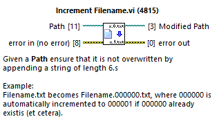
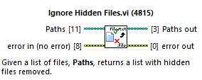
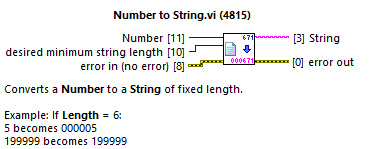

# File Utilities

File Utilities is a LabVIEW library for dealing files.

## Installation

- LabVIEW 2016 32-bit required
- The package can be installed using VI Package Manager as described [here](https://levylabpitt.github.io/).

## Usage

### Increment Filename.vi

### Ignore Hidden Files.vi

### Number to String.vi

## Contributing

Please contact [Patrick Irvin](https://github.com/ciozi137)

## License

[BSD-3](https://opensource.org/licenses/BSD-3-Clause)
